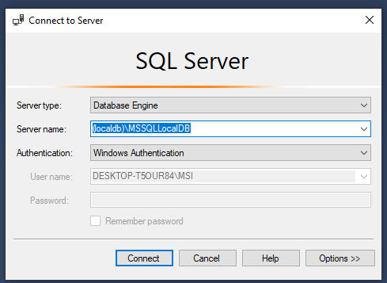

dotnet version 8.0.204

You may have to update the Visual Studio in the Visual Studio Installer

First time:
  git clone https://github.com/jezuscame/Sankabinis.git;
  In the project: Tools -> NuGet Package Manager -> Package Manager Console: Update-Database;
  crtl + f5

After changing database:
  Package Manager Console: Add-Migration <MigrationNameWithoutSpaces>;
  Package Manager Console: Update-Database

Do not forget to push changes

Beginner tutorila pasisetupint ta DB:
1. https://learn.microsoft.com/en-us/sql/database-engine/configure-windows/sql-server-express-localdb?view=sql-server-ver16
Sita instalinini Basic versija;
Tada vel sitam pasirenki download media ir LocalDb(60mb) parsisiunti ir installini;
Jei gerai installinta, cmd parasius SqlLocalDb info, turetu isvest MSSQLLocalDB ar panasiai.

2. https://learn.microsoft.com/en-us/sql/ssms/download-sql-server-management-studio-ssms?view=sql-server-ver16#download-ssms
Sita installini

3. Updatini VisualStudio i naujausia versija

4. Package Manager Console rasai: Update-Database
Turetu veikt, jei ne tai kazkuris is praitu punktu blogas

5. Per ssms galima duombaze pazet;

Reikia nurodyt (localdb)\Local arba (localdb)\MSSQLLocalDB

6. Jei kazka models pakeiti(pridedi lentele ar kazka paeditini):
Jei pridetas nauajs -> Data folderi > SankabinisContext reikia kad butu modelis naudojamas
Package Manager Console: Add-Migration pavadinimas
Package Manager Console: Update-Database

Jeigu lentele nauja man pesasi su esamom lentelem jau tai per ssms istrinu visa duombaze SankabinisDB ir tada Update-Database darau. Bet dingsta visi irasai, tai iskart reiktu pasidaryt viska.